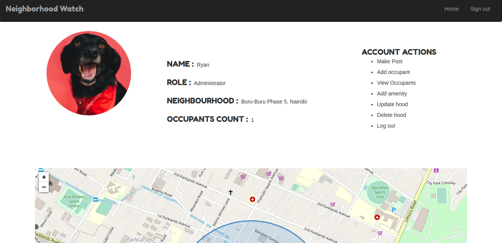

# Neighborhood Watch
#### Neighborhood Watch - a neighborhood mapping application , 12/04/2021.
#### By Ryan Rotich

## Description
<table>
<tr>
<td>
Neighborhood Watch is a neighborhood app tailored for a specific neighborhood. Users may take on either of the two user roles, i.e occupant or administrator.
 
The roles of the administrator involve: adding occupants, adding amenities and general oversight of neighborhood activities. An occupant is able to make a post visible to the neighborhood and also add a business they think would interest other occupants.
</td>
</tr>
</table>

## Live link
Visit the application on  https://neighborhood-ryan.herokuapp.com/.

## Development
To make advancements/modifications, follow these steps:

- Fork the repository
- Create a new branch (`git checkout -b improve-feature`)
- Make the appropriate changes in the files
- Add changes made
- Commit your changes (`git commit -am 'Improve feature'`)
- Push to the branch (`git push origin improve-feature`)
- Create a Pull Request 

## Setup & Run instructions
- Create and activate a virtual environment
- Install the dependencies listed in the `requirements.txt`
- Create a `.env` file. This will contain environment variables as listed in the `.env.sample` file.
- Finally, run your app on `MODE='dev'` config for debugging purposes

## Technologies Used
Technologies used to develop this application:

1. Python v3.9.0
2. Django 3.1.7
3. Javascript
4. Cloudinary
5. Bootstrap
6. HTML 
7. CSS

## Support and contact details

Should you be unable to access the website, have any recommendations and/or questions, feel free to email me:[austinbrian005@gmail.com](mailto:austinbrian005@gmail.com)

### [License](LICENSE)
MIT license
Copyright (c) 2021 **Ryan Rotich**
